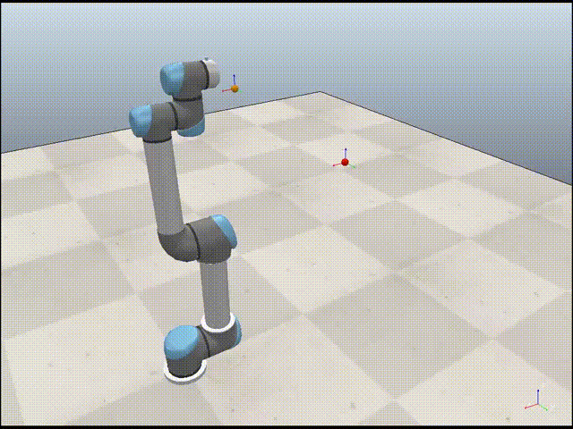
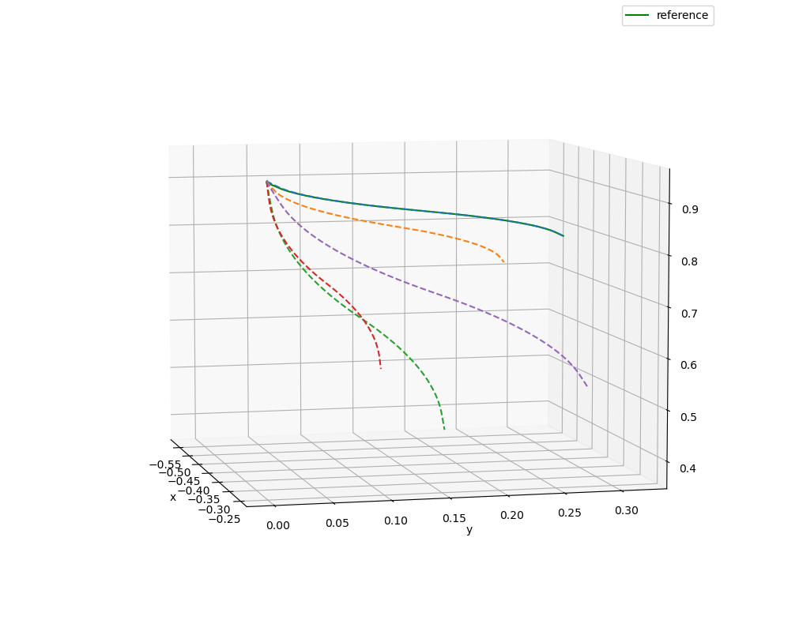
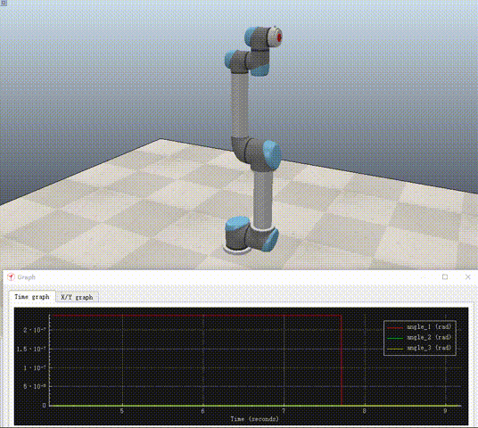
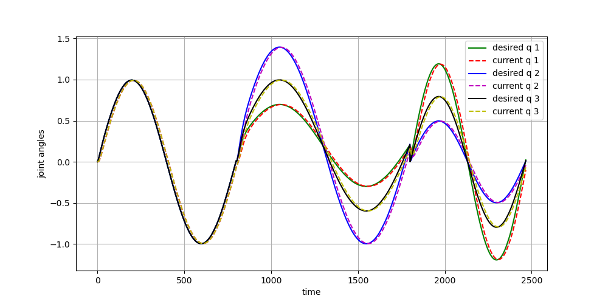

# Dynamic Movement Primitives

---

This code is a Python implementation of DMPs by Chauby (Email: chaubyZou@163.com), it is free for everyone. 

The corresponding tutorial can be found at：

- Zhihu：
- Wechat：

---

The code has been tested on Windows 10 with Anaconda 3,  and NOT tested on Ubuntu or Mac. Since the code is very simple, the author belive it also works well on the other system with Anaconda 3.

Requirements:

- Python 3.6+
- Numpy
- Scipy
- Matplotlib

For simulation on CoppeliaSim, you need to install the CoppeliaSim 4.2 or later version.

---

## Canonical System

Canonical system with different parameters:

----

## Discrete DMP

The DMP model is used to model and reproduce sine and cosine trajectories with a limited time.

The solid curves represent the demonstrated trajectories, the dashed curves represent the reproduced trajectories by DMP models with the same and different initial and goal positions.

---

## Rhythmic DMP

For demonstrated trajecotry with only one dimension.

For demonstrated trajecotry with two dimensions.

---

# Simulation on UR5 robot in CoppeliaSim (V-REP)

## User guide:

1. Open the CoppeliaSim project file in the folder "coppeliasim";
2. Click the "run" button of the CoppeliaSim to run the project file;
3. Run python script "demo_rhythmic_DMP_UR5.py" or "demo_discrete_DMP_UR5.py".

## Discrete DMP

The position of the end-effector are set by the code, and the inverse kinematics calculation model in CoppeliaSim are used to calculate the joint angles of UR5.

The corresponding positions for the end-effector of UR5 are shown as follows:

Randomly modiy goal positions of the reproduced trajectory:

Randomly modify initial and goal positions of the reproduced trajectory:

## Rhythmic DMP

Three joints of the UR5 robot are under control.

The corresponding joint angles are show as follows:

---

## Reference:

The reference paper can be found at the folder named 'paper', and can also be downloaded at:

- [2002 Stefan Schaal](http://citeseerx.ist.psu.edu/viewdoc/summary?doi=10.1.1.142.3886)

- [2013 Auke Ijspeert](http://www-clmc.usc.edu/publications/I/ijspeert-NC2013.pdf)

