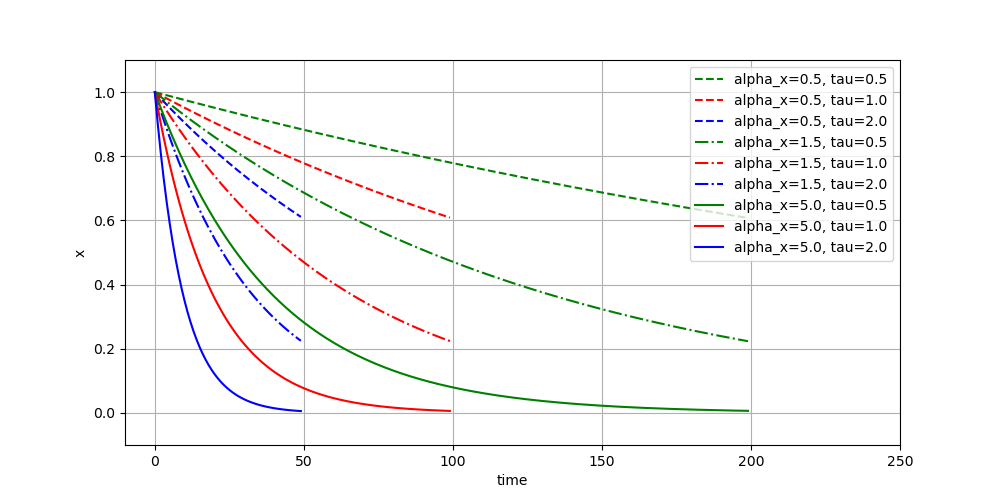
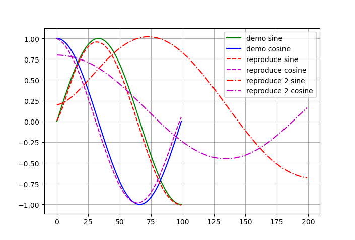
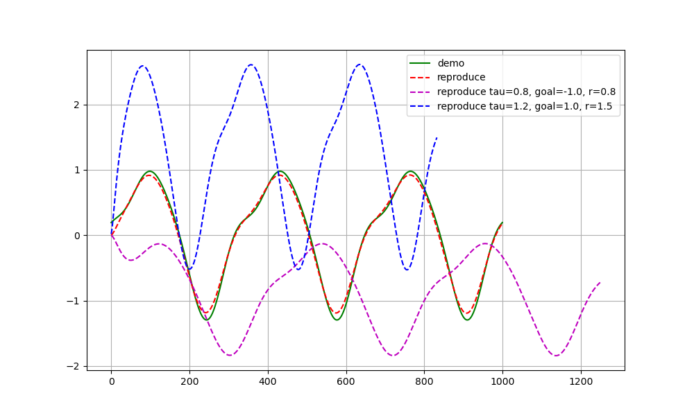
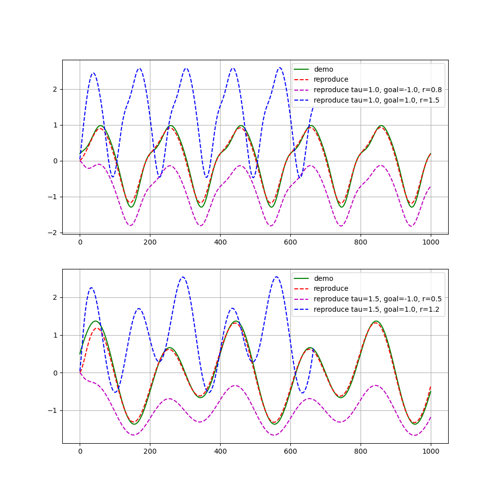

# Dynamic Movement Primitives

---

This code is a Python implementation of DMPs by Chauby (Email: chaubyZou@163.com), it is free for everyone. 

The corresponding tutorial can be found at：

---

The code has been tested on Windows 10 with Anaconda 3,  and NOT tested on Ubuntu or Mac. Since the code is very simple, the author belive it also works well on the other system with Anaconda 3.

Requirements:

- Python 3.6+
- Numpy
- Scipy
- Matplotlib

---

## Canonical system test

Canonical system with different parameters:

----

## Discrete DMP test

The DMP model is used to model and reproduce sine and cosine trajectories with a limited time.

The solid curves represent the demonstrated trajectories, the dashed curves represent the reproduced trajectories by DMP models with the same and different initial and goal positions.

---

## Rhythmic DMP test

For demonstrated trajecotry with only one dimension.

For demonstrated trajecotry with two dimensions.

---

# Simulation on CoppeliaSim (V-REP)

## Discrete DMP

## Rhythmic DMP

---

## Reference:

The reference paper can be found at the folder named 'paper', and can also be downloaded at:

- [2002 Stefan Schaal](http://citeseerx.ist.psu.edu/viewdoc/summary?doi=10.1.1.142.3886)

- [2013 Auke Ijspeert](http://www-clmc.usc.edu/publications/I/ijspeert-NC2013.pdf)