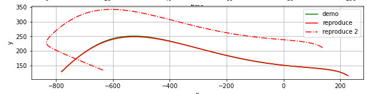
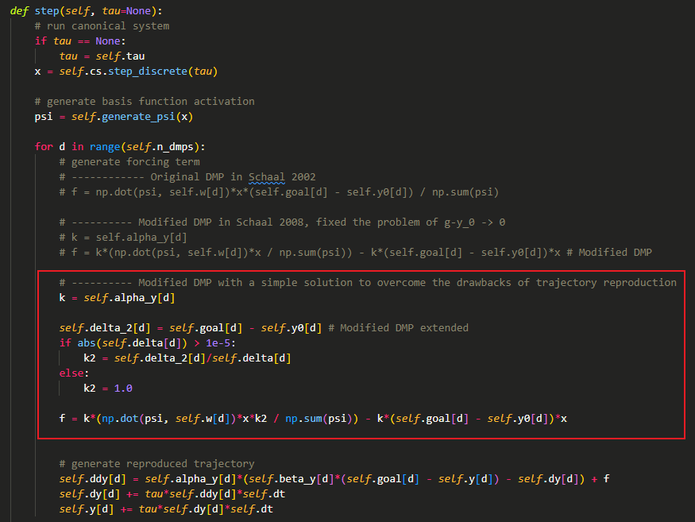

改进型的DMP算法可能存在更改轨迹初始点或目标点以后轨迹形状畸变的问题：

这是由于改进型的DMP算法为了避免轨迹起始点和终止点相同时非线性项$f$无法计算的问题，从而将$g-y_0$与$f$分离了，具体公式详见我知乎的博客。这样就会导致非线性项无法感知轨迹的起始点/目标点与原始示教轨迹起始点/目标点之间的差异，从而无法建模这些变化，导致复现后的轨迹没问题，而改变起始点/目标点以后的轨迹形状发生畸变的问题。

最简单直接的办法就是将这部分再考虑到轨迹建模当中，因此可以使用某种trick将轨迹变化的差异建模到非线性项$f$当中，比如将新的目标点与起始点之间的距离、旧的目标点与起始点之间的距离这两者之间计算一个比例，然后在非线性项$f$中进行放缩：

这样就可以在某些场景下简单的解决这个问题，在观感上不至于差别太大，但是对轨迹数据敏感，很容易引起其他问题，因此无法解决所有情况下的轨迹畸变问题。

系统的解决方法已经放在我的知乎博客中了，另一个作者提出的方法，对非线性项的基函数进行了重新设计。

